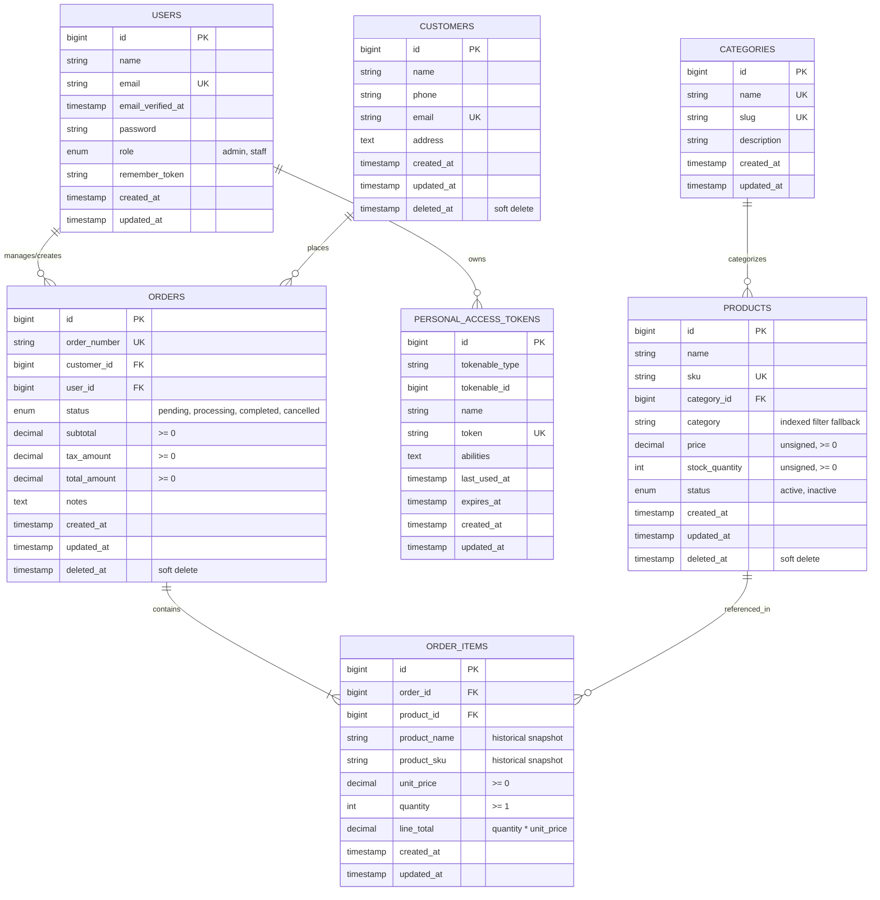

# Database Schema & Entity Relationship Diagram (ERD)

This document defines the complete database architecture for the **Order Management System (OMS)** based on the practical coding test specifications.

---

## 1. Entity Relationship Diagram (ERD)



---

## 2. Table Specifications & Data Dictionaries

### 2.1 `users`
Represents staff and administrative personnel who log in to the system to manage products, customers, and orders.

| Column | Type | Constraints / Defaults | Description |
| :--- | :--- | :--- | :--- |
| `id` | `BIGINT UNSIGNED` | `AUTO_INCREMENT, PRIMARY KEY` | Unique user identifier |
| `name` | `VARCHAR(255)` | `NOT NULL` | Full name of the user |
| `email` | `VARCHAR(255)` | `UNIQUE, NOT NULL` | Login email address |
| `email_verified_at`| `TIMESTAMP` | `NULLABLE` | Verification timestamp |
| `password` | `VARCHAR(255)` | `NOT NULL` | Hashed password (Bcrypt/Argon2id) |
| `role` | `ENUM('admin', 'staff')` | `NOT NULL DEFAULT 'staff'` | Role for RBAC authorization |
| `remember_token`| `VARCHAR(100)` | `NULLABLE` | Session remember token |
| `created_at` | `TIMESTAMP` | `NULLABLE` | Record creation time |
| `updated_at` | `TIMESTAMP` | `NULLABLE` | Record last update time |

* **Indexes**:
  * `PRIMARY KEY (id)`
  * `UNIQUE KEY users_email_unique (email)`
  * `KEY users_role_index (role)`

---

### 2.2 `personal_access_tokens` (Laravel Sanctum)
Used for stateless token-based API authentication between the React/Next.js frontend and Laravel backend.

| Column | Type | Constraints / Defaults | Description |
| :--- | :--- | :--- | :--- |
| `id` | `BIGINT UNSIGNED` | `AUTO_INCREMENT, PRIMARY KEY` | Token ID |
| `tokenable_type` | `VARCHAR(255)` | `NOT NULL` | Morph class (`App\Models\User`) |
| `tokenable_id` | `BIGINT UNSIGNED` | `NOT NULL` | User ID |
| `name` | `VARCHAR(255)` | `NOT NULL` | Token name (e.g. `auth_token`) |
| `token` | `VARCHAR(64)` | `UNIQUE, NOT NULL` | SHA-256 hashed token string |
| `abilities` | `TEXT` | `NULLABLE` | Token permissions/scopes |
| `last_used_at` | `TIMESTAMP` | `NULLABLE` | Last active timestamp |
| `expires_at` | `TIMESTAMP` | `NULLABLE` | Expiration timestamp |
| `created_at` | `TIMESTAMP` | `NULLABLE` | Timestamp |
| `updated_at` | `TIMESTAMP` | `NULLABLE` | Timestamp |

---

### 2.3 `categories` (Optional / Recommended Lookup Table)
Allows flexible category grouping, filtering, and normalization.

| Column | Type | Constraints / Defaults | Description |
| :--- | :--- | :--- | :--- |
| `id` | `BIGINT UNSIGNED` | `AUTO_INCREMENT, PRIMARY KEY` | Category identifier |
| `name` | `VARCHAR(100)` | `UNIQUE, NOT NULL` | Category display name |
| `slug` | `VARCHAR(120)` | `UNIQUE, NOT NULL` | URL/Filter-friendly slug |
| `description` | `TEXT` | `NULLABLE` | Category description |
| `created_at` | `TIMESTAMP` | `NULLABLE` | Creation timestamp |
| `updated_at` | `TIMESTAMP` | `NULLABLE` | Update timestamp |

---

### 2.4 `products`
Stores inventory details. Enforces non-negative price, non-negative stock, and unique SKU.

| Column | Type | Constraints / Defaults | Description |
| :--- | :--- | :--- | :--- |
| `id` | `BIGINT UNSIGNED` | `AUTO_INCREMENT, PRIMARY KEY` | Product ID |
| `name` | `VARCHAR(255)` | `NOT NULL` | Product name |
| `sku` | `VARCHAR(100)` | `UNIQUE, NOT NULL` | Unique stock keeping unit |
| `category_id` | `BIGINT UNSIGNED` | `NULLABLE, FK -> categories.id` | Category relationship (`ON DELETE SET NULL`) |
| `category` | `VARCHAR(100)` | `NOT NULL` | Denormalized category name for rapid filtering |
| `price` | `DECIMAL(10, 2)` | `UNSIGNED, NOT NULL, CHECK (price >= 0)` | Unit sale price |
| `stock_quantity`| `INT UNSIGNED` | `NOT NULL DEFAULT 0, CHECK (stock_quantity >= 0)` | Available physical stock |
| `status` | `ENUM('active', 'inactive')`| `NOT NULL DEFAULT 'active'` | Visibility / saleable status |
| `created_at` | `TIMESTAMP` | `NULLABLE` | Creation timestamp |
| `updated_at` | `TIMESTAMP` | `NULLABLE` | Update timestamp |
| `deleted_at` | `TIMESTAMP` | `NULLABLE` | Soft delete timestamp |

* **Indexes**:
  * `PRIMARY KEY (id)`
  * `UNIQUE KEY products_sku_unique (sku)`
  * `KEY products_category_id_index (category_id)`
  * `KEY products_category_index (category)`
  * `KEY products_status_index (status)`
  * `KEY products_stock_quantity_index (stock_quantity)`
  * `FULLTEXT KEY products_search_fulltext (name, sku)` *(Optional for fast full-text searching)*

---

### 2.5 `customers`
Stores customer profile information.

| Column | Type | Constraints / Defaults | Description |
| :--- | :--- | :--- | :--- |
| `id` | `BIGINT UNSIGNED` | `AUTO_INCREMENT, PRIMARY KEY` | Customer ID |
| `name` | `VARCHAR(255)` | `NOT NULL` | Customer name |
| `phone` | `VARCHAR(50)` | `NULLABLE` | Contact phone number |
| `email` | `VARCHAR(255)` | `UNIQUE, NOT NULL` | Email address |
| `address` | `TEXT` | `NULLABLE` | Shipping / billing address |
| `created_at` | `TIMESTAMP` | `NULLABLE` | Creation timestamp |
| `updated_at` | `TIMESTAMP` | `NULLABLE` | Update timestamp |
| `deleted_at` | `TIMESTAMP` | `NULLABLE` | Soft delete timestamp |

* **Indexes**:
  * `PRIMARY KEY (id)`
  * `UNIQUE KEY customers_email_unique (email)`
  * `KEY customers_name_index (name)`
  * `KEY customers_phone_index (phone)`

---

### 2.6 `orders`
Master order record containing calculated server totals and order status.

| Column | Type | Constraints / Defaults | Description |
| :--- | :--- | :--- | :--- |
| `id` | `BIGINT UNSIGNED` | `AUTO_INCREMENT, PRIMARY KEY` | Order ID |
| `order_number`| `VARCHAR(50)` | `UNIQUE, NOT NULL` | Human-readable identifier (e.g., `ORD-20260916-0001`) |
| `customer_id` | `BIGINT UNSIGNED` | `NOT NULL, FK -> customers.id` | Customer placing order (`ON DELETE RESTRICT`) |
| `user_id` | `BIGINT UNSIGNED` | `NOT NULL, FK -> users.id` | Staff/Admin who created order (`ON DELETE RESTRICT`) |
| `status` | `ENUM('pending', 'processing', 'completed', 'cancelled')` | `NOT NULL DEFAULT 'pending'` | Order processing state |
| `subtotal` | `DECIMAL(10, 2)` | `UNSIGNED, NOT NULL DEFAULT 0.00` | Sum of all line items |
| `tax_amount` | `DECIMAL(10, 2)` | `UNSIGNED, NOT NULL DEFAULT 0.00` | Computed tax amount |
| `total_amount`| `DECIMAL(10, 2)` | `UNSIGNED, NOT NULL DEFAULT 0.00` | Final verified total calculated on server |
| `notes` | `TEXT` | `NULLABLE` | Special instructions or remarks |
| `created_at` | `TIMESTAMP` | `NULLABLE` | Creation timestamp |
| `updated_at` | `TIMESTAMP` | `NULLABLE` | Update timestamp |
| `deleted_at` | `TIMESTAMP` | `NULLABLE` | Soft delete timestamp |

* **Indexes**:
  * `PRIMARY KEY (id)`
  * `UNIQUE KEY orders_order_number_unique (order_number)`
  * `KEY orders_customer_id_index (customer_id)`
  * `KEY orders_user_id_index (user_id)`
  * `KEY orders_status_index (status)`
  * `KEY orders_created_at_index (created_at)`

---

### 2.7 `order_items`
Child order item records. Crucially snapshots historical prices and product details at the moment the transaction occurred.

| Column | Type | Constraints / Defaults | Description |
| :--- | :--- | :--- | :--- |
| `id` | `BIGINT UNSIGNED` | `AUTO_INCREMENT, PRIMARY KEY` | Order item ID |
| `order_id` | `BIGINT UNSIGNED` | `NOT NULL, FK -> orders.id` | Parent order (`ON DELETE CASCADE`) |
| `product_id` | `BIGINT UNSIGNED` | `NOT NULL, FK -> products.id` | Product purchased (`ON DELETE RESTRICT`) |
| `product_name`| `VARCHAR(255)` | `NOT NULL` | Historical snapshot of name at purchase time |
| `product_sku` | `VARCHAR(100)` | `NOT NULL` | Historical snapshot of SKU at purchase time |
| `unit_price` | `DECIMAL(10, 2)` | `UNSIGNED, NOT NULL, CHECK (unit_price >= 0)` | Price per unit at purchase time |
| `quantity` | `INT UNSIGNED` | `NOT NULL, CHECK (quantity > 0)` | Ordered quantity |
| `line_total` | `DECIMAL(10, 2)` | `UNSIGNED, NOT NULL, CHECK (line_total >= 0)` | Verified line total (`unit_price * quantity`) |
| `created_at` | `TIMESTAMP` | `NULLABLE` | Creation timestamp |
| `updated_at` | `TIMESTAMP` | `NULLABLE` | Update timestamp |

* **Indexes**:
  * `PRIMARY KEY (id)`
  * `KEY order_items_order_id_index (order_id)`
  * `KEY order_items_product_id_index (product_id)`

---

## 3. MySQL DDL Creation Script (`schema.sql`)

```sql
-- --------------------------------------------------------
-- Users Table
-- --------------------------------------------------------
CREATE TABLE IF NOT EXISTS `users` (
  `id` BIGINT UNSIGNED NOT NULL AUTO_INCREMENT,
  `name` VARCHAR(255) NOT NULL,
  `email` VARCHAR(255) NOT NULL,
  `email_verified_at` TIMESTAMP NULL DEFAULT NULL,
  `password` VARCHAR(255) NOT NULL,
  `role` ENUM('admin', 'staff') NOT NULL DEFAULT 'staff',
  `remember_token` VARCHAR(100) DEFAULT NULL,
  `created_at` TIMESTAMP NULL DEFAULT CURRENT_TIMESTAMP,
  `updated_at` TIMESTAMP NULL DEFAULT CURRENT_TIMESTAMP ON UPDATE CURRENT_TIMESTAMP,
  PRIMARY KEY (`id`),
  UNIQUE KEY `users_email_unique` (`email`),
  KEY `users_role_index` (`role`)
) ENGINE=InnoDB DEFAULT CHARSET=utf8mb4 COLLATE=utf8mb4_unicode_ci;

-- --------------------------------------------------------
-- Personal Access Tokens (Laravel Sanctum)
-- --------------------------------------------------------
CREATE TABLE IF NOT EXISTS `personal_access_tokens` (
  `id` BIGINT UNSIGNED NOT NULL AUTO_INCREMENT,
  `tokenable_type` VARCHAR(255) NOT NULL,
  `tokenable_id` BIGINT UNSIGNED NOT NULL,
  `name` VARCHAR(255) NOT NULL,
  `token` VARCHAR(64) NOT NULL,
  `abilities` TEXT DEFAULT NULL,
  `last_used_at` TIMESTAMP NULL DEFAULT NULL,
  `expires_at` TIMESTAMP NULL DEFAULT NULL,
  `created_at` TIMESTAMP NULL DEFAULT CURRENT_TIMESTAMP,
  `updated_at` TIMESTAMP NULL DEFAULT CURRENT_TIMESTAMP ON UPDATE CURRENT_TIMESTAMP,
  PRIMARY KEY (`id`),
  UNIQUE KEY `personal_access_tokens_token_unique` (`token`),
  KEY `personal_access_tokens_tokenable_type_tokenable_id_index` (`tokenable_type`, `tokenable_id`)
) ENGINE=InnoDB DEFAULT CHARSET=utf8mb4 COLLATE=utf8mb4_unicode_ci;

-- --------------------------------------------------------
-- Categories Table
-- --------------------------------------------------------
CREATE TABLE IF NOT EXISTS `categories` (
  `id` BIGINT UNSIGNED NOT NULL AUTO_INCREMENT,
  `name` VARCHAR(100) NOT NULL,
  `slug` VARCHAR(120) NOT NULL,
  `description` TEXT DEFAULT NULL,
  `created_at` TIMESTAMP NULL DEFAULT CURRENT_TIMESTAMP,
  `updated_at` TIMESTAMP NULL DEFAULT CURRENT_TIMESTAMP ON UPDATE CURRENT_TIMESTAMP,
  PRIMARY KEY (`id`),
  UNIQUE KEY `categories_name_unique` (`name`),
  UNIQUE KEY `categories_slug_unique` (`slug`)
) ENGINE=InnoDB DEFAULT CHARSET=utf8mb4 COLLATE=utf8mb4_unicode_ci;

-- --------------------------------------------------------
-- Customers Table
-- --------------------------------------------------------
CREATE TABLE IF NOT EXISTS `customers` (
  `id` BIGINT UNSIGNED NOT NULL AUTO_INCREMENT,
  `name` VARCHAR(255) NOT NULL,
  `phone` VARCHAR(50) DEFAULT NULL,
  `email` VARCHAR(255) NOT NULL,
  `address` TEXT DEFAULT NULL,
  `created_at` TIMESTAMP NULL DEFAULT CURRENT_TIMESTAMP,
  `updated_at` TIMESTAMP NULL DEFAULT CURRENT_TIMESTAMP ON UPDATE CURRENT_TIMESTAMP,
  `deleted_at` TIMESTAMP NULL DEFAULT NULL,
  PRIMARY KEY (`id`),
  UNIQUE KEY `customers_email_unique` (`email`),
  KEY `customers_name_index` (`name`),
  KEY `customers_phone_index` (`phone`),
  KEY `customers_deleted_at_index` (`deleted_at`)
) ENGINE=InnoDB DEFAULT CHARSET=utf8mb4 COLLATE=utf8mb4_unicode_ci;

-- --------------------------------------------------------
-- Products Table
-- --------------------------------------------------------
CREATE TABLE IF NOT EXISTS `products` (
  `id` BIGINT UNSIGNED NOT NULL AUTO_INCREMENT,
  `name` VARCHAR(255) NOT NULL,
  `sku` VARCHAR(100) NOT NULL,
  `category_id` BIGINT UNSIGNED DEFAULT NULL,
  `category` VARCHAR(100) NOT NULL,
  `price` DECIMAL(10, 2) UNSIGNED NOT NULL DEFAULT 0.00,
  `stock_quantity` INT UNSIGNED NOT NULL DEFAULT 0,
  `status` ENUM('active', 'inactive') NOT NULL DEFAULT 'active',
  `created_at` TIMESTAMP NULL DEFAULT CURRENT_TIMESTAMP,
  `updated_at` TIMESTAMP NULL DEFAULT CURRENT_TIMESTAMP ON UPDATE CURRENT_TIMESTAMP,
  `deleted_at` TIMESTAMP NULL DEFAULT NULL,
  PRIMARY KEY (`id`),
  UNIQUE KEY `products_sku_unique` (`sku`),
  KEY `products_category_id_foreign` (`category_id`),
  KEY `products_category_index` (`category`),
  KEY `products_status_index` (`status`),
  KEY `products_stock_quantity_index` (`stock_quantity`),
  KEY `products_deleted_at_index` (`deleted_at`),
  CONSTRAINT `fk_products_category_id` FOREIGN KEY (`category_id`) REFERENCES `categories` (`id`) ON DELETE SET NULL,
  CONSTRAINT `chk_products_price` CHECK (`price` >= 0),
  CONSTRAINT `chk_products_stock_quantity` CHECK (`stock_quantity` >= 0)
) ENGINE=InnoDB DEFAULT CHARSET=utf8mb4 COLLATE=utf8mb4_unicode_ci;

-- --------------------------------------------------------
-- Orders Table
-- --------------------------------------------------------
CREATE TABLE IF NOT EXISTS `orders` (
  `id` BIGINT UNSIGNED NOT NULL AUTO_INCREMENT,
  `order_number` VARCHAR(50) NOT NULL,
  `customer_id` BIGINT UNSIGNED NOT NULL,
  `user_id` BIGINT UNSIGNED NOT NULL,
  `status` ENUM('pending', 'processing', 'completed', 'cancelled') NOT NULL DEFAULT 'pending',
  `subtotal` DECIMAL(10, 2) UNSIGNED NOT NULL DEFAULT 0.00,
  `tax_amount` DECIMAL(10, 2) UNSIGNED NOT NULL DEFAULT 0.00,
  `total_amount` DECIMAL(10, 2) UNSIGNED NOT NULL DEFAULT 0.00,
  `notes` TEXT DEFAULT NULL,
  `created_at` TIMESTAMP NULL DEFAULT CURRENT_TIMESTAMP,
  `updated_at` TIMESTAMP NULL DEFAULT CURRENT_TIMESTAMP ON UPDATE CURRENT_TIMESTAMP,
  `deleted_at` TIMESTAMP NULL DEFAULT NULL,
  PRIMARY KEY (`id`),
  UNIQUE KEY `orders_order_number_unique` (`order_number`),
  KEY `orders_customer_id_foreign` (`customer_id`),
  KEY `orders_user_id_foreign` (`user_id`),
  KEY `orders_status_index` (`status`),
  KEY `orders_created_at_index` (`created_at`),
  KEY `orders_deleted_at_index` (`deleted_at`),
  CONSTRAINT `fk_orders_customer_id` FOREIGN KEY (`customer_id`) REFERENCES `customers` (`id`) ON DELETE RESTRICT,
  CONSTRAINT `fk_orders_user_id` FOREIGN KEY (`user_id`) REFERENCES `users` (`id`) ON DELETE RESTRICT,
  CONSTRAINT `chk_orders_subtotal` CHECK (`subtotal` >= 0),
  CONSTRAINT `chk_orders_total_amount` CHECK (`total_amount` >= 0)
) ENGINE=InnoDB DEFAULT CHARSET=utf8mb4 COLLATE=utf8mb4_unicode_ci;

-- --------------------------------------------------------
-- Order Items Table
-- --------------------------------------------------------
CREATE TABLE IF NOT EXISTS `order_items` (
  `id` BIGINT UNSIGNED NOT NULL AUTO_INCREMENT,
  `order_id` BIGINT UNSIGNED NOT NULL,
  `product_id` BIGINT UNSIGNED NOT NULL,
  `product_name` VARCHAR(255) NOT NULL,
  `product_sku` VARCHAR(100) NOT NULL,
  `unit_price` DECIMAL(10, 2) UNSIGNED NOT NULL DEFAULT 0.00,
  `quantity` INT UNSIGNED NOT NULL DEFAULT 1,
  `line_total` DECIMAL(10, 2) UNSIGNED NOT NULL DEFAULT 0.00,
  `created_at` TIMESTAMP NULL DEFAULT CURRENT_TIMESTAMP,
  `updated_at` TIMESTAMP NULL DEFAULT CURRENT_TIMESTAMP ON UPDATE CURRENT_TIMESTAMP,
  PRIMARY KEY (`id`),
  KEY `order_items_order_id_foreign` (`order_id`),
  KEY `order_items_product_id_foreign` (`product_id`),
  CONSTRAINT `fk_order_items_order_id` FOREIGN KEY (`order_id`) REFERENCES `orders` (`id`) ON DELETE CASCADE,
  CONSTRAINT `fk_order_items_product_id` FOREIGN KEY (`product_id`) REFERENCES `products` (`id`) ON DELETE RESTRICT,
  CONSTRAINT `chk_order_items_quantity` CHECK (`quantity` > 0),
  CONSTRAINT `chk_order_items_unit_price` CHECK (`unit_price` >= 0),
  CONSTRAINT `chk_order_items_line_total` CHECK (`line_total` >= 0)
) ENGINE=InnoDB DEFAULT CHARSET=utf8mb4 COLLATE=utf8mb4_unicode_ci;
```

---

## 4. Key Business Logic & Concurrency Design Considerations

1. **Transactional Integrity**:
   - Creating an order executes inside a `DB::transaction(function() { ... })`.
   - All line totals and the grand total are calculated exclusively on the server from the queried product records, completely ignoring any frontend client totals.

2. **Race Conditions & Stock Overselling Protection**:
   - Use pessimistic locking: `Product::where('id', $id)->lockForUpdate()->first();` or atomic decrement:
     ```php
     $affected = Product::where('id', $productId)
         ->where('stock_quantity', '>=', $qty)
         ->decrement('stock_quantity', $qty);
     if ($affected === 0) {
         throw new OutOfStockException("Insufficient stock for product ID: {$productId}");
     }
     ```
   - When an order transitions to `cancelled`, stock is safely restored:
     ```php
     Product::where('id', $item->product_id)->increment('stock_quantity', $item->quantity);
     ```

3. **Historical Snapshots**:
   - `order_items` preserves `product_name`, `product_sku`, and `unit_price`. Even if an admin edits a product's price or deletes/soft-deletes the product later, past invoices and order history remain 100% intact and accurate.
